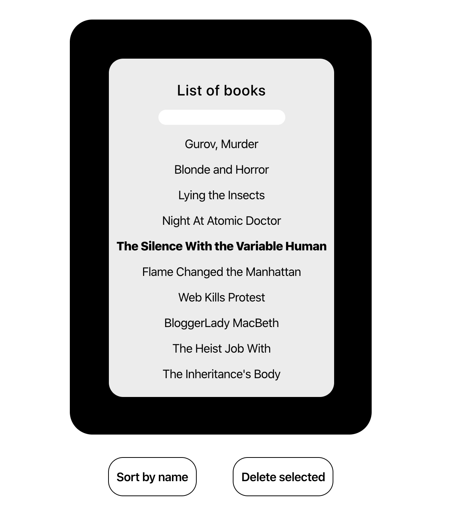

# List of books app

This project was bootstrapped with [Create React App](https://github.com/facebook/create-react-app).

In the project directory, you can run:

### `yarn start`

Runs the app in the development mode. 
Open [http://localhost:3000](http://localhost:3000) to view it in the browser.

The page will reload if you make edits. 
You will also see any lint errors in the console.

### `yarn test`

Launches the test runner in the interactive watch mode. 
See the section about [running tests](https://facebook.github.io/create-react-app/docs/running-tests) for more information.

## Description

Project is as much RWD friendly as I could do in such short period of time.

There are couple of features like selecting, sorting, deleting and adding elements to the list.

I care about tests so feel free to run it. I couldn't develop all of the functionalities but I am sure that it is enough to show my JS skills.
